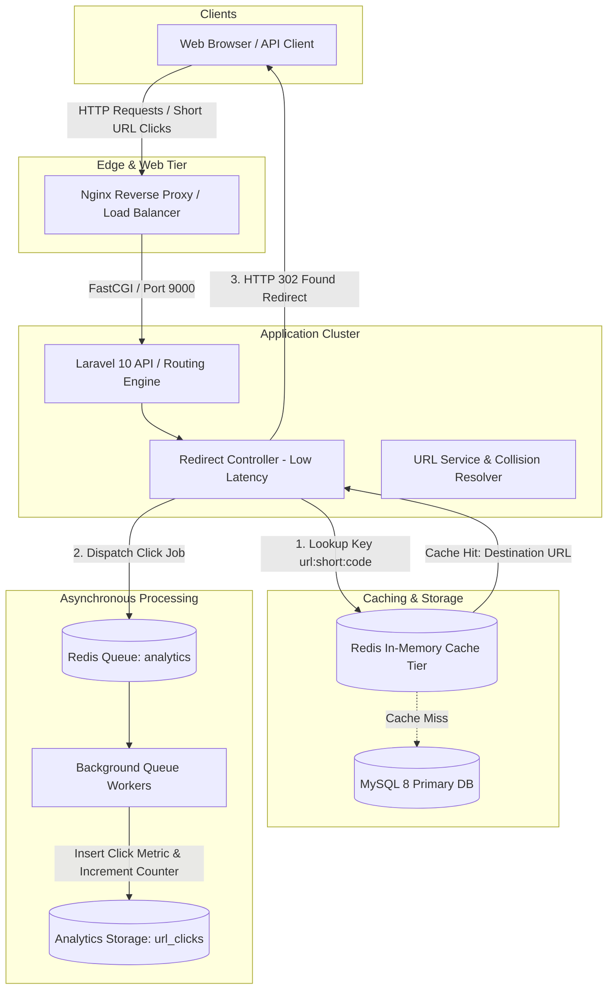
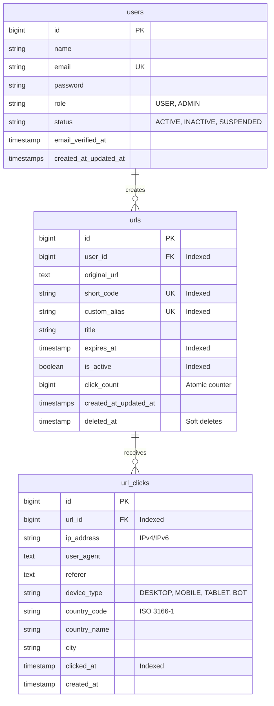

# Scalable URL Shortener

[](https://github.com/your-username/scalable-url-shortener/actions)
[](https://php.net)
[](https://laravel.com)
[](LICENSE)

> A production-grade, high-throughput URL shortening and real-time click analytics engine engineered with clean architecture, sub-millisecond Redis resolution, asynchronous queue streams, and robust observability.

---

## 1. Overview

The **Scalable URL Shortener** is designed to demonstrate senior backend engineering and system design capabilities. It moves beyond basic CRUD operations by addressing real-world scalability constraints: **ultra-low latency redirection hot paths**, **asynchronous telemetry ingestion**, **database contention prevention**, **granular rate limiting**, and **layered security boundaries**.

---

## 2. Key Features

- ⚡ **Sub-Millisecond Redirects**: Redis-backed cache lookup path with transparent MySQL fallback and write-through caching.
- 🔀 **Asynchronous Analytics Streaming**: Non-blocking click telemetry ingestion via dedicated Redis background queue workers (`RecordUrlClickJob`).
- 🛡️ **Zero-Collision Short Codes**: Base62 cryptographically secure code generation with reserved system keyword protection and automatic length expansion.
- 📊 **Rich Click Telemetry**: Aggregation by day, hour, device classification (Mobile/Tablet/Desktop/Bot), geographical location, and referrers.
- 🔐 **Sanctum API Authentication**: Token issuance, revocation, and role-based policy authorization (`Admin` vs. `User`).
- 🚦 **Tiered Rate Limiting**: Independent rate limit thresholds for Auth (10/min), URL Creation (60/min), and Redirects (120/min).
- 🐳 **Complete Dockerized Topology**: Multi-container setup with Nginx, PHP 8.1 FPM, MySQL 8, Redis 7, and dedicated Queue Workers.
- 🧪 **100% Passing Automated Test Suite**: 46+ unit and feature tests validating core logic, policies, queues, caches, and rate limiters.
- 📖 **Interactive OpenAPI 3.0 / Swagger UI**: Fully interactive documentation available at `/docs`.
- 🩺 **Non-Sensitive Health Probes**: Container health check endpoint at `/health` and `/api/v1/health`.

---

## 3. System Architecture



---

## 4. Tech Stack

- **Backend Framework**: [Laravel 10.x](https://laravel.com)
- **Language**: [PHP 8.1](https://www.php.net)
- **Relational Database**: [MySQL 8.0](https://www.mysql.com) (InnoDB)
- **In-Memory Cache & Queue**: [Redis 7.x](https://redis.io) via [Predis](https://github.com/predis/predis)
- **Web Server**: [Nginx 1.25 Alpine](https://nginx.org)
- **Containerization**: [Docker & Docker Compose](https://www.docker.com)
- **Testing**: [PHPUnit 10](https://phpunit.de)
- **API Documentation**: OpenAPI 3.0 & Swagger UI

---

## 5. Database Design



### Strategic Indexes:
- `urls (short_code)` and `urls (custom_alias)`: B-Tree unique indexes for O(log N) cache-miss resolution.
- `urls (user_id, created_at)`: Compound index optimizing user dashboard pagination without filesort.
- `url_clicks (url_id, clicked_at)`: Range queries for time-filtered reports.
- `url_clicks (url_id, device_type)` & `url_clicks (url_id, country_code)`: Fast aggregation grouping.

---

## 6. API Endpoint Reference

| Method | URI | Description | Auth Required | Throttling |
| :--- | :--- | :--- | :--- | :--- |
| `GET` | `/health` | System health probe | No | Standard |
| `GET` | `/{shortCode}` | Public redirect endpoint (HTTP 302) | No | 120/min |
| `POST` | `/api/v1/auth/register` | Register new user account | No | 10/min |
| `POST` | `/api/v1/auth/login` | Authenticate and issue Sanctum token | No | 10/min |
| `POST` | `/api/v1/auth/logout` | Revoke current access token | Bearer Token | - |
| `GET` | `/api/v1/auth/me` | Fetch authenticated user profile | Bearer Token | - |
| `GET` | `/api/v1/urls` | List user's URLs with pagination | Bearer Token | 60/min |
| `POST` | `/api/v1/urls` | Shorten a new URL | Bearer Token | 60/min |
| `GET` | `/api/v1/urls/{id}` | View single URL metadata | Bearer Token (Policy) | - |
| `PUT` | `/api/v1/urls/{id}` | Update URL / alias / expiration | Bearer Token (Policy) | - |
| `DELETE` | `/api/v1/urls/{id}` | Soft-delete URL & evict cache | Bearer Token (Policy) | - |
| `GET` | `/api/v1/urls/{id}/analytics`| Get aggregated click metrics | Bearer Token (Policy) | 30/min |
| `GET` | `/api/v1/admin/stats` | Platform overview KPIs | Admin Token | - |
| `GET` | `/api/v1/admin/users` | List all platform users | Admin Token | - |
| `PATCH`| `/api/v1/admin/users/{id}/status`| Moderate / suspend user | Admin Token | - |
| `GET` | `/api/v1/admin/urls` | List all platform URLs | Admin Token | - |
| `PATCH`| `/api/v1/admin/urls/{id}/status` | Activate / deactivate any URL | Admin Token | - |
| `DELETE`| `/api/v1/admin/urls/{id}` | Admin URL deletion | Admin Token | - |

---

## 7. Caching Strategy

- **Key Patterns**:
  - `url:short:{short_code}`
  - `url:alias:{custom_alias}`
- **TTL**: 24 Hours (`86,400s` configurable via `CACHE_URL_TTL`).
- **Write-Through Invalidation**:
  - Upon creation, Redis is immediately warmed with URL metadata.
  - Upon update or deletion, both short-code and custom-alias keys are evicted immediately.
- **Circuit Breaker / Fallback**:
  - Any Redis connectivity blip is caught gracefully, falling back to indexed MySQL queries without breaking the redirect stream.

---

## 8. Queue Processing & Worker Setup

Click data is not recorded synchronously in the redirect request. Instead, a light event payload is dispatched to the `analytics` queue:

```bash
# Start background worker locally or via Supervisor
php artisan queue:work redis --queue=analytics,default --sleep=3 --tries=3 --timeout=60
```

- **Exponential Backoff**: `[5, 15, 30]` seconds.
- **Failures**: Detailed stack traces logged and persisted to `failed_jobs` table.

---

## 9. Security & Hardening

1. **Strict Scheme Enforcement**: Only `http://` and `https://` destination URLs are accepted. `javascript:`, `data:`, `file:`, `vbscript:` are rejected at the validator layer to prevent stored XSS or SSRF attacks.
2. **Reserved Keyword Collision Shield**: Prevents hijacking internal endpoints (`/api`, `/admin`, `/health`, `/docs`, `/login`, etc.).
3. **Multi-Tenant Policy Guard**: Users can never view, mutate, or inspect analytics of URLs belonging to other users.
4. **Credential Isolation**: Zero plaintext passwords in memory or logs; non-sensitive health check payloads.

---

## 10. Local Development Setup

### Prerequisites
- PHP 8.1
- Composer 2.x
- MySQL 8.x
- Redis 7.x

### Quickstart

```bash
# 1. Clone repository
git clone https://github.com/your-username/scalable-url-shortener.git
cd scalable-url-shortener

# 2. Install dependencies (strictly PHP 8.1 compatible)
composer install

# 3. Setup environment configuration
cp .env.example .env
php artisan key:generate

# 4. Configure MySQL and Redis credentials in .env, then run migrations & seeders
php artisan migrate --seed

# 5. Start development server
php artisan serve
```

### Pre-Seeded Development Credentials:
- **Admin**: `admin@example.com` / `password123`
- **User**: `user@example.com` / `password123`

---

## 11. Docker Deployment

Launch the complete stack (Nginx, App, MySQL, Redis, and Queue Worker) with a single command:

```bash
# Start containers in detached mode
docker compose up -d

# Execute migrations and seed demo data inside container
docker compose exec app php artisan migrate --seed

# Access the application
# Web App:   http://localhost:8000
# API Docs:  http://localhost:8000/docs
# Health:    http://localhost:8000/health
```

---

## 12. Automated Testing

Execute the automated PHPUnit test suite:

```bash
# Run all unit and feature tests
php artisan test
```

All 46 tests run against an in-memory SQLite database and test array/redis caches.

---

## 13. System Design Documentation

Detailed system design breakdowns are available in the [`docs/`](./docs) directory:

- 🏛️ [System Architecture](./docs/architecture.md)
- 🗄️ [Database Design & Optimization](./docs/database.md)
- ⚡ [Caching Strategy & Redis Keys](./docs/caching.md)
- 🔀 [Asynchronous Queues & Worker Architecture](./docs/queue.md)
- 🚦 [Rate Limiting Matrix](./docs/rate-limiting.md)
- 📈 [Scalability & Growth Roadmap (1K to 10M+ Users)](./docs/scalability.md)
- 🛡️ [Security Implementation](./docs/security.md)
- ⚖️ [Architectural Trade-Offs & Decisions](./docs/trade-offs.md)
- 📖 [OpenAPI 3.0 Specification](./docs/openapi.yaml)

---

## 14. License

This project is open-sourced software licensed under the [MIT license](LICENSE).
