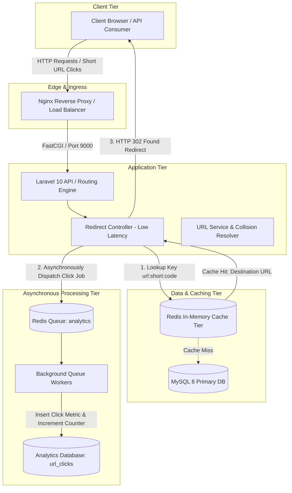

# System Architecture

## 1. High-Level Architectural Overview

The **Scalable URL Shortener** is engineered with a **layered, decoupled clean monolith architecture** optimized for low-latency redirection and high-throughput write streams.

---

## 2. Request Lifecycle & Path Segregation

### A. Critical Redirection Path (Hot Path)
1. **Lookup**: Direct read from **Redis** (`url:short:{code}` or `url:alias:{alias}`) in under 2ms.
2. **Fallback**: If cache miss, read from indexed MySQL table (`urls.short_code` / `urls.custom_alias`), populate Redis with TTL, and proceed.
3. **Event Streaming**: Dispatch `RecordUrlClickJob` onto the Redis `analytics` queue asynchronously.
4. **Immediate Redirect**: Return HTTP 302 with strict non-caching headers so future clicks trigger analytics while keeping client experience instantaneous.

### B. Management & Analytics Path (Cold/Warm Path)
- Standard REST API operations (`/api/v1/urls`, `/api/v1/urls/{id}/analytics`) authenticated via **Laravel Sanctum**.
- Authorized through **Laravel Policies** enforcing strict multi-tenant resource boundaries.
- Cache invalidation executed immediately on URL update or soft deletion.

---

## 3. Technology Rationale

| Component | Selected Technology | Architectural Rationale |
| :--- | :--- | :--- |
| **Framework** | Laravel 10.x (PHP 8.1) | Clean ecosystem, mature DI container, built-in queue/cache abstractions, and robust testing support. |
| **Primary Cache** | Redis 7 | O(1) key lookups, sub-millisecond read latency, built-in TTL expiration. |
| **Queue Broker** | Redis Queues | Low-overhead FIFO job buffering, high throughput, retry backoff support. |
| **Relational DB** | MySQL 8 | ACID compliance, unique B-Tree indexing on short codes, JSON and datetime aggregation capabilities. |
| **Web Server** | Nginx Alpine | Lightweight event-driven reverse proxy, Gzip compression, fast HTTP static asset delivery. |
