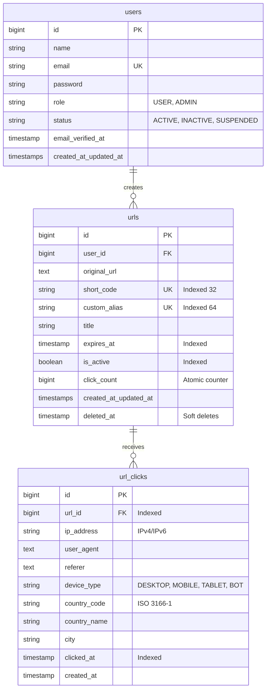

# Database Design & Optimization

## 1. Schema Design

---

## 2. Strategic Indexing Strategy

1. **`urls.short_code` & `urls.custom_alias`**:
   - Unique B-Tree indexes. Enables O(log N) lookup on cache misses.
2. **`urls (is_active, expires_at)`**:
   - Compound index for high-speed availability validation.
3. **`urls (user_id, created_at)`**:
   - Compound index optimizing user dashboard pagination without filesort.
4. **`url_clicks (url_id, clicked_at)`**:
   - Compound index facilitating fast range queries for date filters (`from` and `to`).
5. **`url_clicks (url_id, device_type)` & `url_clicks (url_id, country_code)`**:
   - Indexes supporting real-time `COUNT(*)` aggregations without full table scans.

---

## 3. Separation of Core Metadata & Analytics Data

### Why separate `urls` and `url_clicks`?
- **Row Width & Memory Footprint**: Keeping `urls` lean ensures InnoDB buffer pool caches significantly more active URLs in RAM.
- **Write Contention**: Hundreds of concurrent clicks do not lock the core `urls` record. Clicks append linearly into `url_clicks` via asynchronous queue jobs.
- **Data Lifecycle Management**: Historical clicks can be archived or partitioned by time range without affecting active URL routing.
