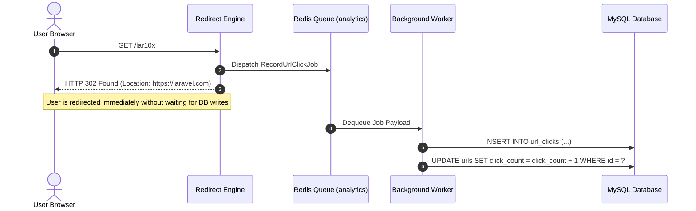

# Asynchronous Queue Architecture

## 1. Asynchronous Ingestion Workflow

To achieve sub-millisecond redirect latency, database insertions for click telemetry are strictly decoupled from the HTTP redirect lifecycle:



---

## 2. Resilience, Retries & Dead-Letter Handling

- **Queue Driver**: Redis.
- **Dedicated Queue**: `analytics` (segregated from default email or notification queues).
- **Retry Policy**:
  - `tries = 3`
  - `backoff = [5, 15, 30]` seconds (exponential backoff).
- **Worker Execution Command**:
  ```bash
  php artisan queue:work redis --queue=analytics,default --sleep=3 --tries=3 --timeout=60
  ```
- **Failure Logging**: Unrecoverable job failures are written to `failed_jobs` table with full stack trace and logged via Monolog.
